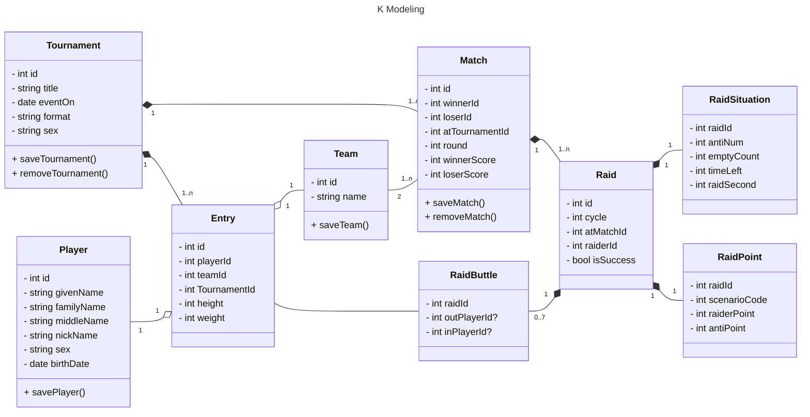

# Overview

Hi

## DevDependencies

### Prettier & ESLint

```sh
pnpm add -D prettier eslint-config-prettier prettier-plugin-tailwindcss eslint eslint-import-resolver-typescript eslint-plugin-import eslint-plugin-jsx-a11y eslint-plugin-react eslint-plugin-react-hooks @typescript-eslint/eslint-plugin @remix-run/eslint-config eslint-plugin-tailwindcss eslint-plugin-drizzle
```

### Tsyringe

```sh
pnpm add tsyringe reflect-metadata
```

### Drizzle

better-sqliteは不要

```sh
pnpm add drizzle-orm
pnpm -D drizzle-kit
```

### Tailwind

guide : [link](https://tailwindcss.com/docs/guides/remix)

```sh
pnpm add -D tailwindcss
npx tailwindcss init --ts
```

### @testing-library

```sh
pnpm add -D @testing-library/dom @testing-library/jest-dom @testing-library/react @testing-library/user-event
```

### Vitest

```sh
pnpm add -D vite vitest vite-tsconfig-paths @vitejs/plugin-react happy-dom @testing-library/jest-dom
```

#### setup-test-env.ts

```ts
import '@testing-library/jest-dom'
import { installGlobals } from '@remix-run/node'
import '@testing-library/jest-dom/vitest'
installGlobals()
```

## Class Diagram


